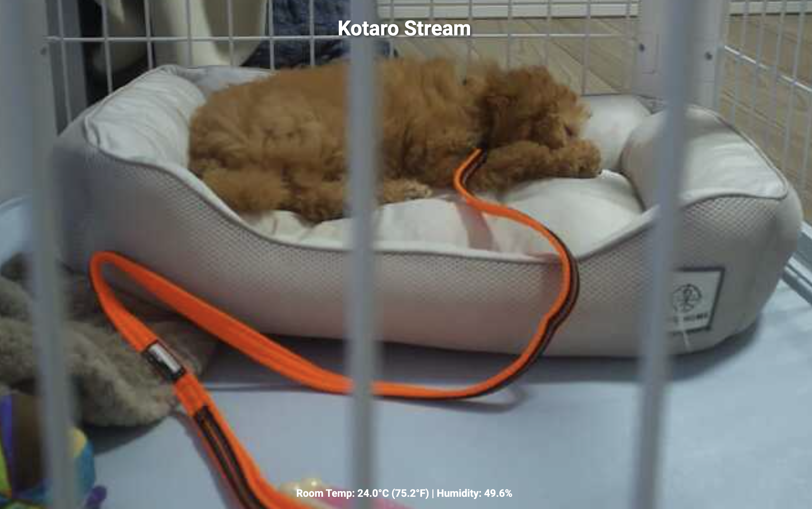

# Dogo Cam

Manual Raspberry Pi dog camera: Flask web UI, live Picamera2 stream, pan/tilt MG90S servos (keyboard, on‑screen arrows, mobile touch‑drag), temperature/humidity readout (local DHT22 or Home Assistant), and optional Cloudflare Tunnel. Manual‑only (tracking removed).



## Layout

- `dogcam_stream.py` — Flask app + camera endpoints
- `servo_control_rpigpio.py` — MG90S pan/tilt control
- `ky004-control.py` — optional GPIO on/off switch
- `templates/` — camera UI + login
- `service_startup/` — example systemd units
- `deploy/` — CI deploy script + scoped sudoers
- `PIN_DIAGRAM.md` — full wiring reference

## Hardware

Raspberry Pi (Pi OS) + CSI camera + 2× MG90S servos, plus optional GPIO toggle switch, DHT22 (`GPIO4`), and cooling fan.


| Part | Signal / V+ / GND pins | Notes |
|------|------------------------|-------|
| CSI camera | ribbon → CSI port | dedicated camera port, not GPIO |
| Tilt servo (servo1) | `GPIO18` (Pin 12) / Pin 2 (5V) / Pin 14 | |
| Pan servo (servo2) | `GPIO19` (Pin 35) / Pin 4 (5V) / Pin 39 | |
| Toggle switch | `GPIO17` (Pin 11) / Pin 17 (3.3V) / Pin 25 | 3‑pin module |
| DHT22 (optional) | `GPIO4` (Pin 7) / Pin 1 (3.3V) / Pin 9 | |
| Cooling fan | Pin 4 (5V, split with pan) / Pin 6 | |

Servos and fan draw from the Pi 5V rail with shared ground. The mount is inverted, so the stream is flipped in software (`DOGCAM_CAMERA_VIEW=upside_down`). See `PIN_DIAGRAM.md` for the full pinout.

**Switch** (`ky004-control.py`): ON (`GPIO17` low) starts `dog-stream` (and `cloudflared-tunnel` if enabled); OFF stops them cleanly. Set `SWITCH_ON_VALUE=1` if your module is inverted, or `SWITCH_PIN` for a different GPIO.

## Controls

- Desktop: arrow buttons, `↑ ↓ ← →`, or `W A S D`
- Mobile: tap/hold above/below center (tilt) or left/right (pan)

## Environment

Copy `.env.example` to `.env` on the Pi (never commit it). The most relevant settings:

```env
SECRET_KEY=replace_me
MAX_VIEWERS=3
PORT=5000
STREAM_MAX_FPS=15          # framerate cap; lower = less power draw (see Power & stability)
STREAM_WIDTH=1296          # stream resolution (default 1296x972, was 640x480)
STREAM_HEIGHT=972          #   1080p works but VGA/960p are gentler on the 5V rail
DOG_NAME=Kotaro
DOGCAM_CAMERA_VIEW=normal  # or upside_down
# --- NoIR wide-angle camera: colour tuning + day/night ---
CAM_TUNING_FILE=ov5647_noir.json  # NoIR tuning kills the daylight magenta cast; "" = sensor default
CAM_SHARPNESS=1.5          # ISP tuning (0-16); also CAM_CONTRAST/CAM_SATURATION/CAM_BRIGHTNESS/CAM_EV
CAM_NOISE_REDUCTION=fast   # off|fast|high_quality|minimal|zsl
CAM_SAT_BRIGHT=1.0         # saturation in real daylight (>= CAM_BRIGHT_LUX)
CAM_SAT_DIM=0.7            # saturation at the day/night edge (artificial light = IR false colour)
CAM_BRIGHT_LUX=400         # lux considered real daylight
NIGHT_MAX_FPS=6            # night mode lowers fps so exposure can lengthen (real sensitivity)
CAM_NIGHT_EV_MAX=1.0       # EV bias at total darkness (scaled to 0 at DAYNIGHT_NIGHT_LUX)
DAYNIGHT_AUTO=1            # auto colour(day)/grayscale(night) off the camera Lux meter
DAYNIGHT_NIGHT_LUX=5       # below this (sustained DAYNIGHT_NIGHT_AFTER=45s) -> night
DAYNIGHT_DAY_LUX=12        # above this (sustained DAYNIGHT_DAY_AFTER=8s) -> day; eager to show colour
DAYNIGHT_MODE=auto         # startup override: auto|day|night
CAM_ZOOM=1.0               # digital zoom 1.0-CAM_ZOOM_MAX(4.0) via ScalerCrop
SWITCH_PIN=17
SWITCH_ON_VALUE=0
TEMP_SOURCE=sensor         # or ha
ENABLE_CLOUDFLARED=1       # 0 when a reverse proxy owns the domain
```

See `.env.example` for the full list (servo tuning, Home Assistant, Cloudflare, proxy‑trust flags).

**Reverse‑proxy mode** — when another host (e.g. a Mac mini running Traefik/Authelia/Cloudflare) owns the public domain and proxies to the Pi: set `ENABLE_CLOUDFLARED=0`, `TRUST_PROXY_HEADERS=1`, and (behind Authelia) `TRUST_PROXY_AUTH_HEADERS=1` so a `Remote-User` header is trusted, plus `DOGCAM_LOGOUT_URL=https://auth.example/logout`. Camera movement is limited to users in `DOGCAM_CONTROL_GROUPS`; others can view only. Keep all `TRUST_PROXY_*` at `0` in standalone mode.

**Temperature source** — `/temp` reads a local DHT22 (`TEMP_SOURCE=sensor`, needs `adafruit_dht`, wired to `GPIO4`) or Home Assistant (`TEMP_SOURCE=ha` + `HA_URL`/`HA_TOKEN`/`HA_*_ENTITY` using an HA long‑lived token). HA mode skips the DHT22 dependency.

## Camera capabilities

The sensor is an **OV5647 behind a wide‑angle NoIR (no IR‑cut filter) lens**. NoIR sees in the dark under IR light, but has two quirks this app handles:

- **Daytime magenta cast.** With no IR‑cut filter, IR leaks into the red/blue channels and standard `ov5647.json` can't correct it (AWB alone leaves it purple). `CAM_TUNING_FILE=ov5647_noir.json` loads the NoIR colour‑correction matrix and neutralises it. *The tuned `Picamera2` must be constructed before any other camera‑manager call — `global_camera_info()` first silently pins the default tuning.*
- **Automatic day/night.** `DAYNIGHT_AUTO=1` runs **colour by day, grayscale by night** (colour is pure noise under IR in the dark), switched off the camera's own AE **Lux** meter — no extra hardware. Two thresholds (`DAYNIGHT_NIGHT_LUX` / `DAYNIGHT_DAY_LUX`) with per‑direction sustain times give hysteresis; recovery to day is eager and descent to night is lazy, so a lit room always shows colour.
- **Light‑adaptive tuning.** Under artificial light IR reflects unevenly (green ceiling, magenta fabric) — no white balance fixes it and saturation only amplifies it. So saturation scales with lux (`CAM_SAT_DIM` at the day edge → `CAM_SAT_BRIGHT` in real daylight). Night mode drops to `NIGHT_MAX_FPS` so exposure can lengthen (real light gathering, less power) and adds an EV bias that scales with darkness (a fixed boost blows out a lit room).

All image tuning (`CAM_*`), day/night switching and digital zoom are **ISP‑side `set_controls()` — no pipeline restart and no measurable extra power** (bench‑tested: identical `vcgencmd get_throttled` at VGA vs 1296×972 vs 1080p under a live viewer; the `STREAM_MAX_FPS` cap, not pixel count, bounds the draw). Endpoints (control actions need `DOGCAM_CONTROL_GROUPS`; GETs are view‑only):

| Endpoint | Method | Purpose |
|---|---|---|
| `/camera/info` | GET | active resolution, fps cap, zoom, tuning, day/night mode + lux |
| `/camera/daynight` | GET / POST | read status / set override `{"mode":"auto\|day\|night"}` |
| `/camera/zoom` | GET / POST | read / set digital zoom `{"zoom":2.0}` or `{"step":0.5}` |
| `/snapshot` | GET | latest frame as a still JPEG (serves the live frame — no extra capture) |

Tests: `python3 -m unittest tests.test_camera_features` (runs off‑Pi with stubbed camera libs).

## Raspberry Pi setup

```bash
sudo apt update && sudo apt upgrade -y
sudo apt install -y libgpiod2 libcamera-apps-lite python3-picamera2 python3-dev
# DHT22 only: sudo apt install -y libgpiod-dev
git clone <your-repo-url> dogo-cam && cd dogo-cam
curl -LsSf https://astral.sh/uv/install.sh | sh      # ensure ~/.local/bin is on PATH
uv sync
uv run gunicorn --worker-class gthread --workers 1 --threads 4 --bind 0.0.0.0:5000 dogcam_stream:app
```

Then open `http://<pi-ip>:5000`.

## systemd

Example units are in `service_startup/`. Copy `dog-stream-flask.service` → `/etc/systemd/system/dog-stream.service`, adjust `User` / `WorkingDirectory` / `EnvironmentFile` / `ExecStart`, then:

```bash
sudo systemctl daemon-reload && sudo systemctl enable --now dog-stream
```

Optionally install `button-control.service` (GPIO switch), `dogcam-watchdog.{service,timer}` (self‑healing), and `cloudflared-tunnel.service` (standalone tunnel mode — after creating the tunnel + `~/.cloudflared/config.yml` and setting `ENABLE_CLOUDFLARED=1`).

## Deploying updates

**Manual:**

```bash
cd ~/dogo-cam && git pull && uv sync && sudo systemctl restart dog-stream
```

**Push to deploy (CI):** `.github/workflows/deploy.yml` runs on a **self‑hosted runner** (on an always‑on box you trust, e.g. the mini). On every push to `main` (or manual `workflow_dispatch`) it SSHes to the Pi and runs a fixed deploy script — the runner's *outbound* connection means the Pi can stay behind NAT with no inbound webhook. Because this is a **public repo**, it's locked down (see below): the runner uses a command‑locked SSH key that can only run `deploy/dogcam-deploy.sh`. Install the artifacts:

```bash
sudo install -m0755 deploy/dogcam-deploy.sh /usr/local/bin/dogcam-deploy.sh
sudo install -m0440 deploy/dogcam-deploy.sudoers /etc/sudoers.d/dogcam-deploy
# then add the forced-command line (see dogcam-deploy.sh header) for the deploy key to authorized_keys
```

## Power & stability

A Pi 3B funnels all current through its micro‑USB / polyfuse (~2–2.5A), so camera + MJPEG encoding + servos can brown out the 5V rail (under‑voltage) even with a strong supply — the camera stalls or the app hangs.

- **`STREAM_MAX_FPS`** (default 15) caps the framerate to cut peak draw — the biggest lever (`vcgencmd get_throttled` non‑zero = dips).
- Single‑shot autofocus at startup (imx708) avoids continuous AF‑motor draw and PDAF log spam.
- Real fix: power the servos from a **separate 5V** (common ground), or use a Pi 4/5.
- **Self‑healing (three layers):**
  1. `/video_feed` gives up after `STREAM_FRAME_TIMEOUT` (5s) without a frame, so a stalled camera can't pin gunicorn's 4 threads and take the whole app down (this was the "open the camera page → everything crashes" loop). The page reconnects the `` automatically and shows *🟡 Stream Stalled* meanwhile.
  2. If no frames arrive for `STREAM_STALL_RESTART_AFTER` (20s) the app tears down and re‑creates the Picamera2 pipeline in‑process — no service restart, the UI stays up.
  3. `dogcam-watchdog.timer` restarts the *service* only if the app is dead, or if `/stream_health` stays 503 past `STALL_ESCALATE_SECONDS` (120s). `dog-stream.service` uses `TimeoutStopSec=15` + `KillMode=mixed` so a stuck camera cleanup can't wedge it in `deactivating`.
- `GET /stream_health` → `{"healthy", "frames", "last_frame_age_s", ...}` (200/503) for dashboards and external monitors.
- Blank feed but `camera_status` says available → reseat the **CSI ribbon** (a loose cable gives "Camera frontend timed out" / zero frames while the sensor still enumerates on I²C). Check `journalctl -u dog-stream | grep -i "Restarting camera"` to see how often the pipeline is stalling.
- Tests: `python3 -m unittest tests.test_stream_stall` runs the app off‑Pi with stubbed camera libs and reproduces the thread‑exhaustion bug.

## Security hardening

Important for a public repo with a self‑hosted runner:

- SSH key‑only (`PasswordAuthentication no`, `PermitRootLogin no`); minimal `authorized_keys` (admin + command‑locked deploy key).
- Firewall `:5000` to the proxy/tunnel host + localhost; drop the rest.
- Disable unused services (e.g. Samba on `139/445`) — keep the surface to `:22` + `:5000`.
- Scoped deploy sudo (`deploy/dogcam-deploy.sudoers`, restart only); avoid `NOPASSWD: ALL` on the service user.

## Notes

- `.env` stays only on the Pi / your local machine.
- Servo positions persist in `/tmp/servo_positions.json`; tune with `SERVO_STEP_SIZE` / `SERVO_SETTLE_SECONDS`.
